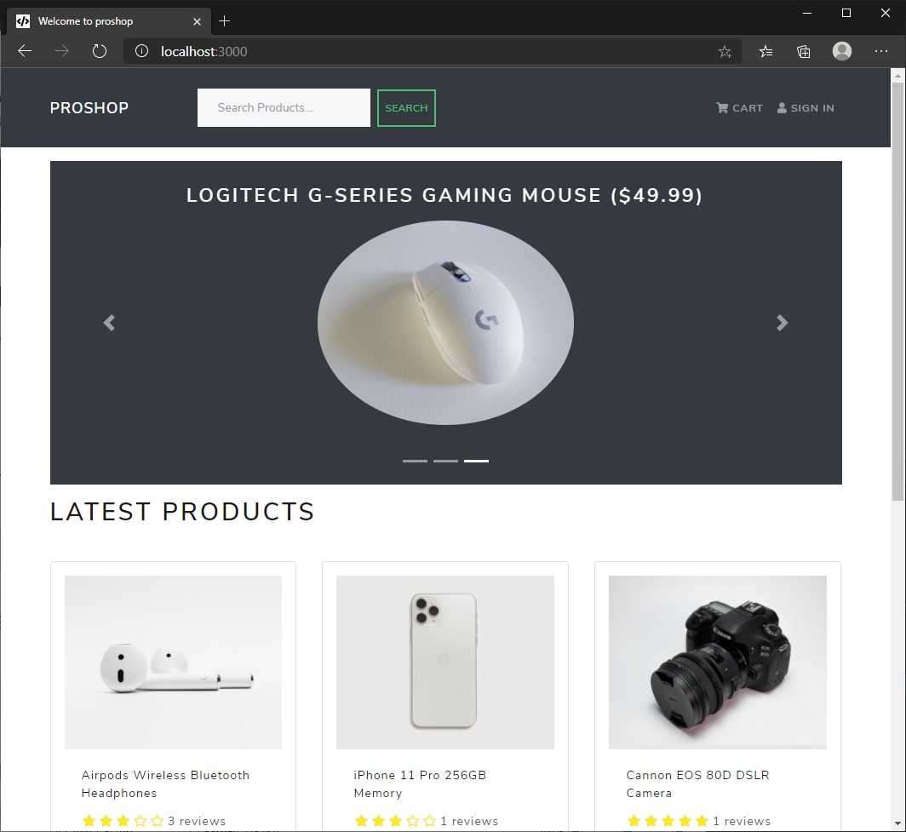
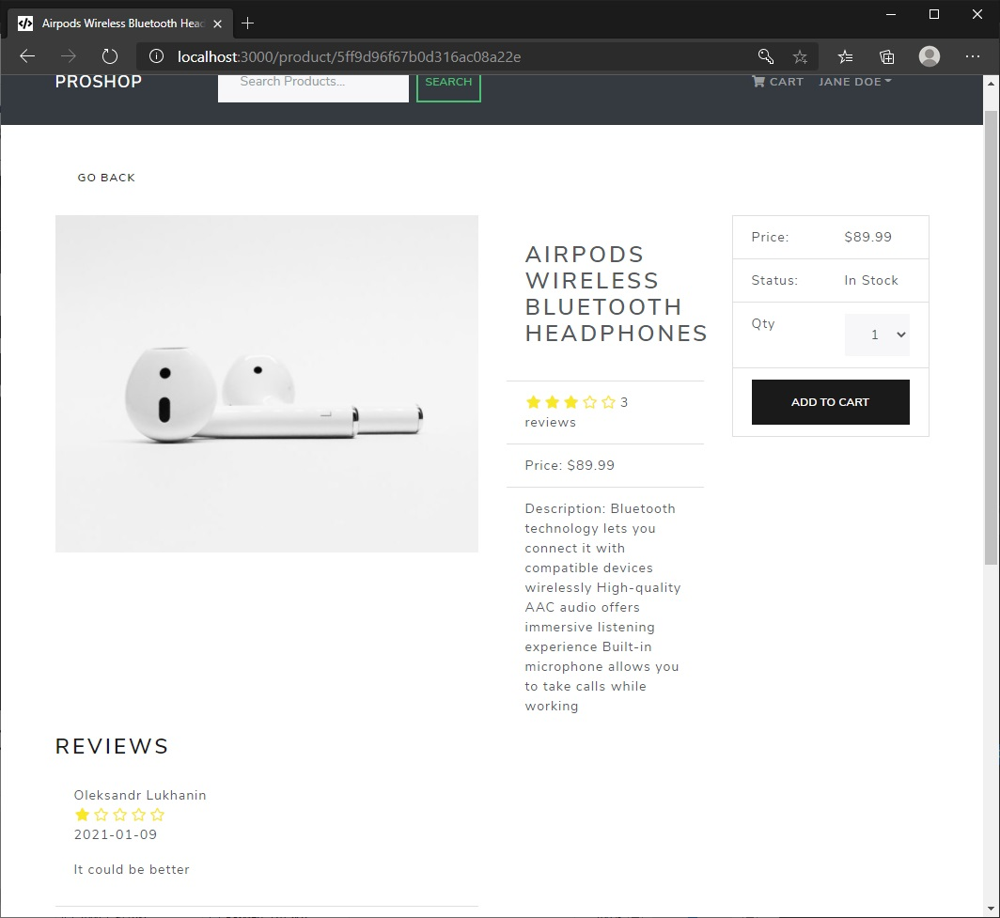
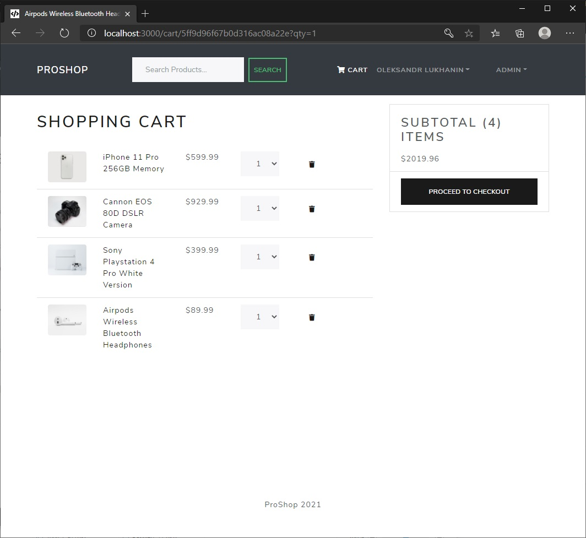
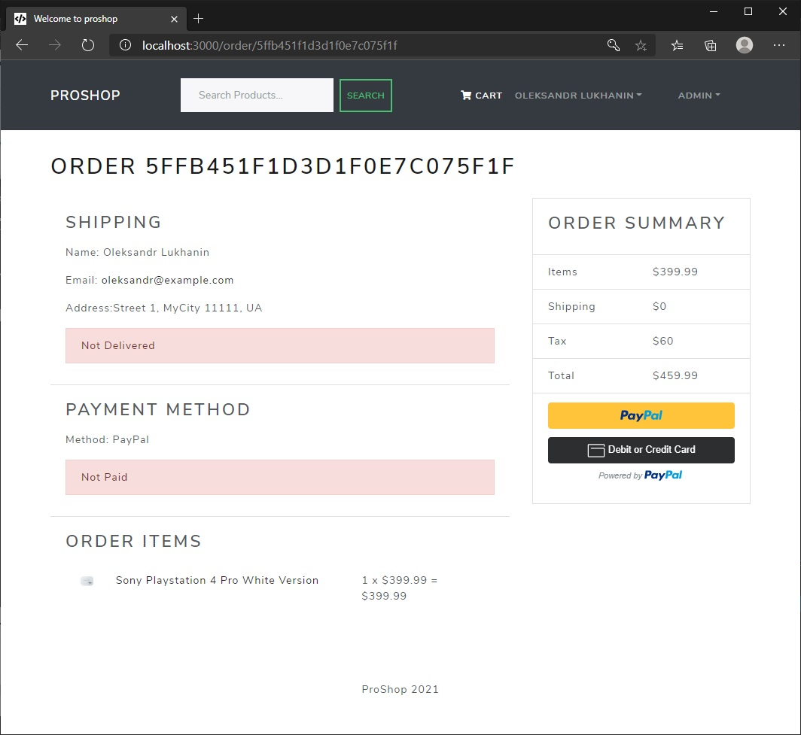
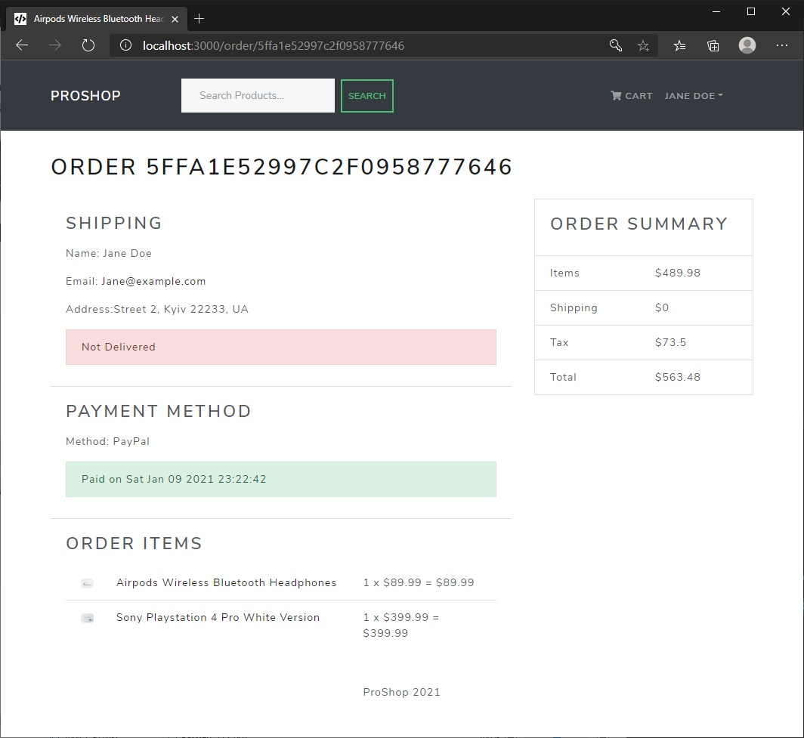
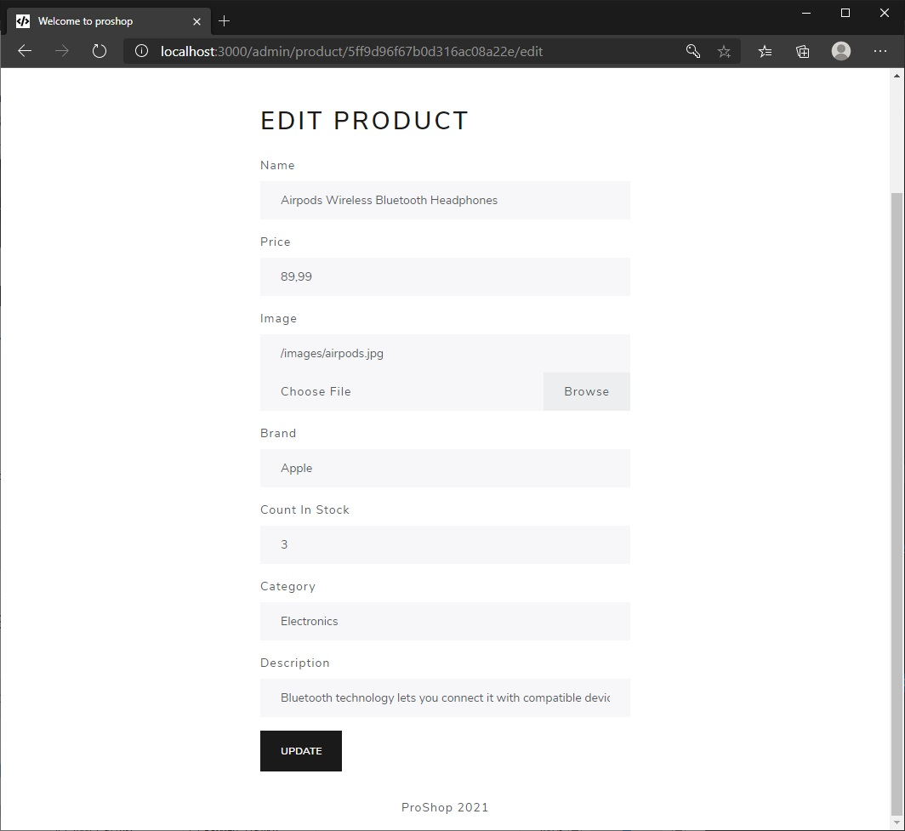

# [ProShop eCommerce Platform](https://xander-proshop.herokuapp.com/)

# Description

eCommerce platform built with the MERN stack & Redux. This app includes authentication, profiles, products catalog, shopping cart etc. Users can make purchases, review products, rate them. Authenticated admin users can modify products catalog, mark paid orders to delivery, give admin rights regular users. Payment system is developed with PayPal API.

## Features

- Full featured shopping cart
- Product reviews and ratings
- Top products carousel
- Product pagination
- Product search feature
- User profile with orders
- Admin product management
- Admin user management
- Admin Order details page
- Mark orders as delivered option
- Checkout process (shipping, payment method, etc)
- PayPal / credit card integration
- Database seeder (products & users)

##### \*This project is based on Brad Traversy's MERN eCommerce From Scratch

<br>
<p align="center">
    
  
  
  
  
  
</p>

## Live demo

Live demo of the app is hosted on Heroku.  
Visit [https://xander-proshop.herokuapp.com/](https://xander-proshop.herokuapp.com/)

Test users credentials:

> Admin user
>
> - login - _admin@example.com_
> - password - _123456_

> Regular user
>
> - login - _john@example.com_
> - password - _123456_

_Due to demo reasons and heroku free terms, if an app receives no web traffic in a 30-minute period, it will sleep. Therefore, during the first launch, the application may take longer to load than usual, approximately 15 - 20 seconds. So please be patient and wait for the app to launch. Subsequent launches will be relatively fast._

## Technology stack

> ### FrontEnd
>
> - React
> - React Hooks
> - Redux with Hooks
> - React router
>
> ### BackEnd
>
> - Node
> - Express
> - JWT
> - MongoDB
> - PayPal API
> - Heroku hosting
>   <br>

## Usage

Clone this repository to desired location

```Shell
git clone https://github.com/XanderUZZZER/proShop.git
```

<br>
### Env Variables

Create a .env file in then root and add the following

```
NODE_ENV = development
PORT = 5000
MONGO_URI = your mongodb uri
JWT_SECRET = 'secret'
PAYPAL_CLIENT_ID = your paypal client id
```

### Install Dependencies (frontend & backend)

```
npm install
cd frontend
npm install
```

### Run

```
# Run frontend (:3000) & backend (:5000)
npm run dev
# Run backend only
npm run server
```

## Build & Deploy

```
# Create frontend prod build
cd frontend
npm run build
```

There is a Heroku postbuild script, so if you push to Heroku, no need to build manually for deployment to Heroku

### Seed Database

You can use the following commands to seed the database with some sample users and products as well as destroy all data

```
# Import data
npm run data:import
# Destroy data
npm run data:destroy
```

```
Sample User Logins
admin@example.com (Admin)
123456
john@example.com (Customer)
123456
jane@example.com (Customer)
123456
```
